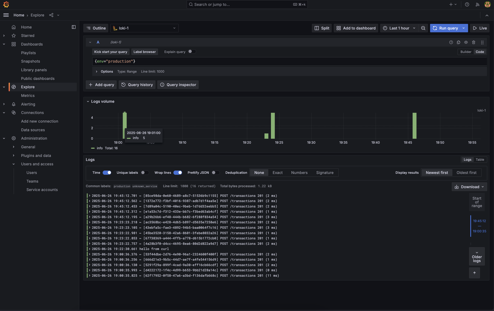

# Challenge API – Guia Rápido

> **Stack:** NestJS 20 + pnpm | Docker | Loki | Grafana

Este README mostra como **subir o ambiente** completo (API + observabilidade) e **visualizar os logs** no Grafana Explore.

---

## 1. Pré‑requisitos

| Ferramenta        | Versão mínima | Verificação              |
| ----------------- | ------------- | ------------------------ |
| Docker            |  24.x         | `docker --version`       |
| Docker Compose V2 | 2.x           | `docker compose version` |

> O compose abre as portas **3000** (API) e **3001** (Grafana). Ajuste se já estiverem em uso.

---

## 2. Clone & suba o ambiente

```bash
# clone o repositório
git clone https://github.com/seu-usuario/challenge-nestjs.git
cd challenge-nestjs

# constrói e inicia (em segundo plano)
docker compose up -d --build
```

O comando acima:

1. **Compila** a imagem `challenge-api-prod` via `Dockerfile.server`.
2. Sobe **Loki** (porta 3100) para armazenar logs.
3. Sobe **Grafana** (porta 3001) para explorar esses logs.

A primeira execução pode demorar alguns minutos devido ao build e download das imagens.

---

## 3. Acessar a API

```bash
curl http://localhost:3000/health
```

Resposta esperada:

```json
{ "status": "ok" }
```

---

## 4. Visualizar logs no Grafana

1. Abra **[http://localhost:3001](http://localhost:3001)** e faça login (`admin` / `admin`).

2. **Adicione o Loki como _Data Source_**:
   1. Menu lateral → **Connections → Data sources → Add data source**.
   2. Escolha **Loki**.
   3. Em **URL** digite `http://loki:3100` (é o serviço interno definido no Compose).
   4. Clique **Save & Test** → deve aparecer "Data source is working".

3. Agora clique em **Explore**.

4. No seletor de _Data source_ escolha **Loki** (o que acabou de criar).

5. No campo de query insira:

```logql
   { env = "production" }
```



Você verá as linhas de log enviadas pela API em tempo real.

Use os controles de intervalo (Last 5m, 15m…) para ajustar o período.

---

## 5. Encerrar o ambiente

```bash
docker compose down -v  # remove containers, redes e volumes dados
```
